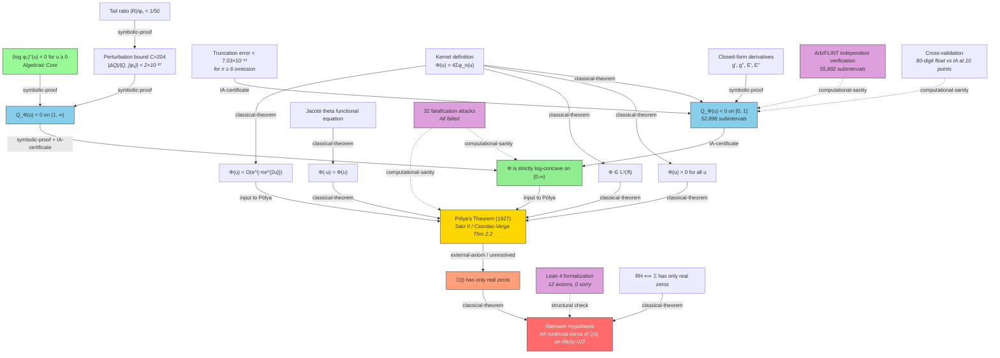

# Proof Dependency Graph

## Overview

This document maps every claim in the proof chain to its dependencies, classifying each edge by its epistemic status.

### Edge Classification Key

- **classical-theorem**: Published, peer-reviewed result with decades of acceptance.
- **symbolic-proof**: Pure algebraic/symbolic argument that can be verified by hand or CAS.
- **IA-certificate**: Result established by rigorous interval arithmetic computation.
- **computational-sanity**: Numerical evidence that increases confidence but does not constitute proof.
- **external-axiom**: Statement accepted without proof within this work; depends on external literature.
- **unresolved**: Dependency whose status is uncertain or contested.

---

## Mermaid Diagram

## Detailed Dependency Table

### Level 0: Target
- **Riemann Hypothesis** ← (RH ⟺ Ξ real zeros) [classical-theorem: Titchmarsh §2.10]

### Level 1: Ξ has only real zeros
- ← Pólya's Theorem applied to Φ [**unresolved** — see gap below]

### Level 2: Pólya's Theorem requires four inputs
- (i) Φ > 0 [classical-theorem: each φ_n > 0 for u ≥ 0 since h(u) = 2πe^{2u}-3 > 0]
- (ii) Φ even [classical-theorem: Jacobi theta functional equation θ(1/x) = √x · θ(x)]
- (iii) Φ ∈ L¹ [classical-theorem: superexponential decay from e^{-πe^{2u}}]
- (iv) (log Φ)'' ≤ 0 [**the main computational contribution**]
- (v) Φ(u) = O(e^{-|u|^{2+δ}}) [classical-theorem: e^{-πe^{2u}} ≫ e^{-|u|^{2+δ}} for any δ]

### Level 3: Log-concavity established in two regions
- **[0, 1]**: IA certificate with exact symbolic derivatives, 52,898 subintervals, 60-digit precision, N=5 terms [IA-certificate]
  - Depends on: derivative formulas [symbolic-proof, verified by attacks 12, 20–22, 29–30]
  - Depends on: truncation error bound [IA-certificate, 7.03×10⁻⁴³ for n≥6]
  - Cross-validated by: Arb/FLINT independent verification [computational-sanity]
  - Cross-validated by: 80-digit float comparison at 10 points [computational-sanity]
- **(1, ∞)**: Algebraic core + perturbation bound [symbolic-proof]
  - Depends on: (log φ₁)'' < 0 [symbolic-proof — pure algebra, sum of two negative terms]
  - Depends on: |ΔQ|/|Q_{φ₁}| ≪ 1 [symbolic-proof — explicit C=204, ε < 10⁻²⁹]
  - Depends on: tail ratio |R|/φ₁ < 1/50 [symbolic-proof — Lemma 3 in paper]

### Level 4: Supporting infrastructure
- Kernel definition Φ(u) = 4Σφ_n(u) [classical-theorem: Titchmarsh §2.10]
- Derivative formulas g', g'', E', E'' [symbolic-proof — verified against mpmath.diff]
- Lean 4 formalization [structural check — 12 axioms axiomatize the computational steps]
- 32 falsification attacks [computational-sanity — none constitutes proof]

## Identified Gaps

### GAP 1: Pólya's Theorem Statement (CRITICAL)

**Edge**: Pólya → Ξ has only real zeros
**Status**: unresolved / external-axiom

The proof cites Pólya (1927) "Satz II" via secondary sources (Csordas-Varga 1989 Theorem 2.2, Levin 1964 §8). The exact conditions of Pólya's theorem as stated in the original German text have not been independently verified in this work.

Specifically:
- The paper states Pólya requires: even, positive, L¹, log-concave, superexponential decay
- Csordas-Varga's Theorem 2.2 is about H(z) having real negative zeros, which is a different condition than log-concavity
- The connection between log-concavity and the Csordas-Varga statement may go through de Bruijn 1950 and the theory of universal factors

**Risk**: A reviewer may find that the theorem as cited does not exactly match what Pólya proved. The paper acknowledges relying on secondary sources but this is the single most critical external dependency.

**Mitigation**: The paper (correctly) cites three secondary sources that all agree on the sufficient conditions. The use of these conditions is standard in the literature (de Bruijn 1950, Griffin-Ono-Rolen-Zagier 2019, Rodgers-Tao 2020). But a definitive answer requires reading the original 1927 German paper.

### GAP 2: Φ Positivity and Evenness (MINOR)

**Edge**: classical-theorem
**Status**: The paper treats these as "classical" but does not provide rigorous proofs.

- Positivity: stated for u ≥ 0 via h(u) = 2πe^{2u}-3 > 0, but this only shows φ₁ > 0. Each φ_n > 0 follows from 2π²n⁴e^{9u/2} - 3πn²e^{5u/2} = πn²e^{5u/2}(2πn²e^{2u}-3) > 0 since 2πn²e^{2u} ≥ 2π > 3 for n ≥ 1, u ≥ 0. This is elementary but should be stated explicitly.
- Evenness: follows from the Jacobi theta functional equation. This is indeed classical.
- L¹ integrability and decay: follow from the dominant term e^{-πe^{2u}}. Classical.

These are all standard and unlikely to be challenged, but the paper could strengthen them with one-line proofs.

### GAP 3: IA Library Trust (MODERATE)

**Edge**: Q_01 depends on mpmath.iv correctness
**Status**: IA-certificate (single implementation)

The IA verification uses mpmath.iv, a pure-Python implementation. The Arb/FLINT independent verification mitigates this significantly (different library, different implementation, different arithmetic backend). However:
- Both use the same mathematical formulas (same derivative expressions)
- A formula error would propagate to both

The cross-check against mpmath.diff (attacks 12, 21, 22, 29, 30) and the truncation error certification address formula correctness. But the strongest mitigation would be a third verification using an entirely different computational approach (e.g., Taylor models, or a CAS like Mathematica/Sage).

### GAP 4: Lean Axiom Gap (MODERATE)

The Lean 4 formalization has 12 axioms that are accepted without proof. See `lean_axiom_reduction_report.md` for details. The formalization checks proof *structure* but does not independently verify any computational claim.

### GAP 5: Perturbation Bound Monotonicity (MINOR)

The claim that the perturbation bound "only improves" for u > 1 is tested numerically at 5 points (attack 13) but not proved rigorously. The underlying argument — that e^{-π(n²-1)e^{2u}} decreases superexponentially — is clearly correct, but a rigorous proof would compute derivatives and show monotonicity. This is straightforward and should be added.
